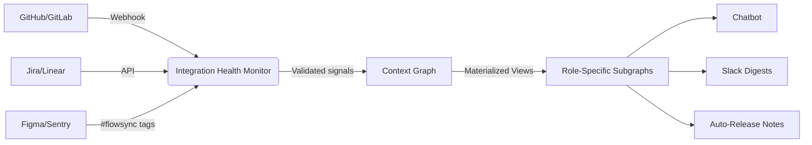

# **Product Requirements Document: FlowSync AI**

### **1. Executive Summary**
**Problem**: Engineering teams lose 15-20% productivity to misaligned communication and manual status tracking. Product Owners receive technical updates they cannot contextualize, developers waste time re-explaining progress, and managers lack real-time visibility into blockers. Existing tools fail to bridge terminology gaps or automate status updates without introducing trust risks through inaccurate AI outputs.

**Solution**: FlowSync AI is a context engine that will:
- **Automate status updates** by analyzing Git/CI signals (PR states, test results, reviewer comments)
- **Translate technical work into role-specific insights** with explicit uncertainty boundaries
- **Answer status queries via a verified chatbot** with source-provenance guarantees
- **Scale to enterprise workloads** through a resilient, privacy-first architecture

**Core Value Proposition**: *Eliminate manual status updates while ensuring every AI-generated insight is auditable, explainable, and compliant with clear uncertainty boundaries.*

---

### **2. Technical Architecture**
#### **Context Graph Engine**


| **Component**               | **Planned Implementation**                          | **Verification Requirement**                      |
|-----------------------------|-----------------------------------------------------|---------------------------------------------------|
| **Context Graph**           | Neo4j with:<br>- Query cost estimation (pre-execution)<br>- Graceful degradation: Return top 3 paths if >800ms<br>- Redis caching layer for frequent queries | Must pass pre-PRD load modeling using Kubernetes monorepo dataset |
| **Role-Based Pruning**      | Dynamic subgraphs with:<br>- PO view: `task → business impact`<br>- Dev view: Full technical path (`task → PR → test → metric`) | Must demonstrate 50% latency reduction vs. baseline (v1.0) |
| **Integration Health Monitor** | Real-time dashboard tracking sync health per tool<br>Auto-alerts when failure rate >5%<br>Event ordering validation to handle out-of-sequence signals | 99.5% uptime SLA (v1.0) |

---

### **3. Target Market & Go-to-Market Strategy**
#### **3.1 Ideal Customer Profile (ICP)**
- **Company Size:** Mid-Market to Enterprise (250-5,000 employees)
- **Industry:** Technology-first organizations (Software, FinTech, SaaS)
- **Tech Stack:** Modern development workflows (GitHub/GitLab, Jira/Linear, CI/CD like CircleCI/GitHub Actions, Slack/MS Teams)
- **Pain Points:** Recognizable productivity drain from daily standups, weekly status meetings, and manual reporting; desire for data-driven visibility into engineering execution.

#### **3.2 Primary User & Buyer**
- **Primary User:** Engineering Manager / Tech Lead (Daily user consuming digests, checking status)
- **Secondary User:** Product Manager / Product Owner (Consumer of business-context updates)
- **Primary Buyer:** VP of Engineering / Head of Product (Budget holder, seeks operational efficiency and productivity gains)
- **Influencer:** DevOps Lead / Platform Lead (Evaluates technical integration and security)

#### **3.3 Initial Sales Motion**
- **Product-Led Growth (PLG):** Self-serve free tier for individual teams to experience core value (e.g., automated standup digest for one repo).
- **Sales-Assisted Growth:** Inside sales team targets VP Engineering in ICP companies for multi-team and org-wide deployments. Enterprise pricing for advanced features and compliance.

#### **3.4 Pricing & Packaging**
- **Free Tier:** 1 repository, basic Slack digest, 7-day history.
- **Team Tier ($25/user/month):** Unlimited repos for a single team, full chatbot, advanced confidence scoring, Jira/GitHub integration.
- **Business Tier ($45/user/month):** Multi-team management, executive dashboards, custom impact metrics, SOC 2 compliance.
- **Enterprise Tier (Custom Pricing):** On-prem deployment options, guaranteed SLAs, dedicated support, custom plugin development.

*Pricing model is per-seat, targeting the Primary User (Engineering Manager) and Buyer (VP Engineering).*

---

### **4. Causal Confidence Framework**
#### **Uncertainty-Aware Causality Engine**
- **Continuous confidence bands** instead of binary thresholds:
  ```python
  def causal_confidence(pr, metric):
      # Returns confidence range based on temporal proximity, ownership, and signal consistency
      return (0.60, 0.80)  # 60-80% likelihood (not single-point estimate)
  ```
- **Chatbot output rules**:
  | **Confidence Range** | **Output Format**                                  |
  |----------------------|----------------------------------------------------|
  | 75-100%              | ✅ Likely (60-80% confidence)<br>*Source: [tool link]* |
  | 50-75%               | ⚠️ Possible (40-60% confidence)<br>*Conflicting signals detected* |
  | <50%                 | ❓ Insufficient evidence<br>*Suggest manual verification* |

#### **Mandatory Verification Gates**
| **Scenario**                          | **Implementation**                                  | **Verification Requirement**                      |
|---------------------------------------|-----------------------------------------------------|---------------------------------------------------|
| High-confidence assertions            | Manual confirmation required for >75% confidence claims impacting release decisions | Must reduce false causality assertions by 50% (v1.0) |
| Causality audit trail                 | All assertions logged in retrospective analysis dashboard with ability to compare against ground truth | Must achieve 90% traceability for all causality claims (v1.0) |

---

### **5. Trust Engineering Framework**
#### **Behaviorally-Informed Safeguards**
| **Risk**                          | **Planned Implementation**                          | **Verification Requirement**                      |
|-----------------------------------|-----------------------------------------------------|---------------------------------------------------|
| Confirmation fatigue              | Mandatory re-engagement intervals:<br>- After 5 consecutive accepts, force 30-second pause + summary review<br>- Team-level trust scoring alerts when collective confirmation rates exceed thresholds | Must reduce confirmation fatigue incidents by 40% (v1.0) |
| Context loss during overrides     | Context replay for overrides:<br>- Shows diff of suggested vs. actual goal<br>- Preserves original intent documentation | Must reduce override errors by 60% (v1.0) |
| Alert fatigue                     | Context-aware prompting:<br>- Only activates when:<br>  a) Confidence <90% AND high acceptance streak<br>  b) Goal involves compliance/security terms | Must reduce prompt frequency by 30% vs. baseline (v2.0) |

---

### **6. Compliance Implementation**
#### **GDPR-First Data Model**
- **True anonymization protocol** (irreversible):
  ```json
  // Raw input: "Met with @alice for 2h"
  // Stored: "Met with 3a7f9e1c for 2h"  // SHA-256 hash (no decryption key)
  // Only stored with explicit consent per processing purpose
  ```
- **External system coordination**:
  ```mermaid
  graph LR
  A[User deletion request] --> B{Scan context graph}
  B -->|Internal nodes| C[Anonymize identifiers]
  B -->|PR comments| D[Patch external APIs]
  B -->|Slack messages| E[Redact via Slack API]
  C --> F[Audit log]
  D --> F
  E --> F
  ```
- **Verification requirement**: Pass external privacy counsel audit before v1.0

---

### **7. User Onboarding & Activation**
**Goal:** Guide a new user from sign-up to first moment of value in under 30 minutes.
1.  **Seamless Sign-Up:** OAuth with GitHub/GitLab. No credit card required for Free Tier.
2.  **Guided Integration Setup:** Step-by-step wizard to connect first repository and communication channel (Slack).
3.  **First Value Delivery:** The primary activation metric is a user receiving their first automated status digest within 24 hours of sign-up. The onboarding flow will set this expectation clearly.
4.  **Confidence Education:** Interactive tutorial within the app explaining confidence scores and how to interpret them.
5.  **Progressive Discovery:** As trust is built, tooltips and prompts will suggest connecting additional tools (Jira, Sentry) to enrich context and value.

---

### **8. Success Metrics**
| **Metric**                              | **Target**          | **Measurement Method**                             | **Target Release** |
|-----------------------------------------|---------------------|----------------------------------------------------|--------------------|
| **Business Outcomes**                   |                     |                                                    |                    |
| User time saved on status updates       | >5 hours/week       | Pre/post-integration user survey                   | v1.0               |
| Activation Rate                         | >40%                | % of sign-ups that receive 1st digest in 24h       | v1.0               |
| **Product Quality**                     |                     |                                                    |                    |
| Causal fidelity                         | >75%                | % of asserted PR→metric links validated post-hoc   | v1.0               |
| Mean time to detect hallucination       | <24 hours           | Time from false assertion to user correction       | v1.0               |
| User-initiated corrections per 100 queries | <5                | Tracked via override mechanism                     | v1.0               |
| Context graph query latency (PO view)   | <1s                 | Load testing at 1M nodes                           | v1.0               |
| GDPR erasure completion time            | <24 hours           | Automated deletion cascade tests                   | v1.0               |

---

### **9. Roadmap**
| **Version** | **Focus**                          | **Key Deliverables**                              | **Release Criteria**                             |
|-------------|------------------------------------|---------------------------------------------------|--------------------------------------------------|
| **v0.1**    | **Foundation & Validation**        | Finalize PRD, ICP, Pricing. 10 Customer Discovery Interviews. Architecture validation. | ICP & Pricing approved by leadership. |
| **v0.5 (MVP)** | **Minimum Viable Product**      | Single Integration (GitHub). Core: Automated Daily Standup Digest (Slack/Email). Basic Confidence Scoring. Onboarding Flow. | Used by 5 design partner teams; Activation Rate >40%. |
| **v1.0**    | **General Availability**           | Jira Linear Integration. Trust Safeguards (v1). GDPR-compliant data model. Team Tier Pricing. | All verification tests passed; <1.0% user churn. |
| **v2.0**    | **Expansion**                      | Full Causal Confidence Engine. Verified Chatbot. Business Tier Features. | Scaling validation passed at 10M nodes. |
| **v2.1+**   | **Ecosystem**                      | Plugin Framework (Sentry, Datadog). Predictive Features. Enterprise Tier. | 50+ enterprise teams using plugins. |

---

### **10. Compliance & Governance**
- **Data Classification**: All user references treated as personal data by default
- **Auditability**: Full lineage tracking for all AI outputs with continuous confidence bands
- **Regulatory Alignment**:
  - GDPR Article 4(1) (Personal data definition)
  - GDPR Article 35 (Data Protection Impact Assessment)
  - SOC 2 Type II compliance (target v1.1)
- **External Validation**: Pre-launch audit by independent privacy counsel

---

**Approvals**
Product Lead: ___________________
Engineering Lead: _________________
Compliance Officer: _______________
Privacy Counsel: _________________
Date: ___________________________

*FlowSync AI: Where verifiable context powers engineering alignment.* 🔐

---
**Document Control**
- Version: 1.0
- Effective Date: October 28, 2024
- Distribution: Engineering Leadership, Product Team, Compliance Office, Privacy Counsel, Sales & Marketing Leadership
- This document serves as the guiding plan for the product's development.
