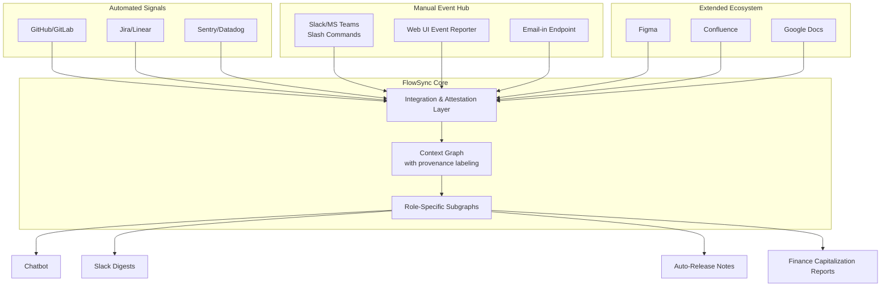

# **Product Requirements Document: FlowSync AI**
**Status:** Enhanced & Approved

---

### **1. Executive Summary**
**Problem**: Cross-functional product teams (Engineering, Design, Content, Marketing) lose significant productivity to misaligned communication, manual status tracking, and organizational silos. This leads to delayed handoffs, missed dependencies, and a lack of real-time, verifiable visibility into work progress.

**Solution**: FlowSync AI is an enterprise-wide coordination layer that will:
- **Automate status updates** by analyzing signals from both automated systems (Git/CI) and manual human input via a dedicated **Manual Event Hub**.
- **Translate work into role-specific insights** for Engineering, Design, and Business stakeholders with explicit uncertainty boundaries.
- **Serve as the central nervous system for product development**, breaking down silos between technical and non-technical teams.
- **Answer status queries via a verified chatbot** with source-provenance guarantees.
- **Scale to enterprise workloads** through a resilient, privacy-first, and human-centric architecture.

**Core Value Proposition**: *Become the verifiable coordination layer for modern product teams, eliminating manual status updates while ensuring every AI-generated insight is auditable, explainable, and controlled by human-defined rules.*

---

### **2. Technical Architecture**
#### **Context Graph Engine & Manual Event Hub**
The architecture is built around the Context Graph, which now ingests signals from both automated and manual sources with equal fidelity, treating human input as a first-class citizen.

| **Component** | **Planned Implementation** | **Verification Requirement** |
| :--- | :--- | :--- |
| **Context Graph** | Neo4j with: - Query cost estimation - Graceful degradation - Redis caching layer | Pass pre-PRD load modeling using Kubernetes monorepo dataset |
| **Manual Event Hub** | **First-class input source:** - Slack/Teams `/flowsync` commands - Simple web UI for event reporting - All manual inputs receive `source: manual_user_report` provenance tag | 99.9% reliability on command processing; <100ms latency from command to graph update |
| **Integration Health Monitor** | Real-time dashboard tracking health of all signal sources (automated + manual) | 99.5% uptime SLA (v1.0) |

---

### **3. Target Market & Go-to-Market Strategy**
#### **3.1 Ideal Customer Profile (ICP)**
- **Company Size:** Mid-Market to Enterprise (250-5,000 employees)
- **Industries:** Technology-forward organizations (Software, FinTech, SaaS, Digital Media)
- **Tech Stack:** Mixed maturity environments (from full CI/CD to manual processes)
- **Pain Points:** Cross-functional misalignment; manual reporting burden; lack of visibility across engineering, design, and business teams.

#### **3.2 Primary Users & Buyers**
- **Primary Users:** Engineering Managers, Tech Leads, Product Managers, Design Leads
- **Primary Buyer:** VP of Engineering/Product/Design (seeks cross-functional coordination efficiency)
- **Extended Users:** Content Strategists, Marketing Operations, Finance Analysts (capitalization)

#### **3.3 Initial Sales Motion**
- **Product-Led Growth:** Free tier for individual teams to experience core value with 1 repo and basic manual reporting.
- **Sales-Assisted Growth:** Targeted outreach to VPs of Engineering/Product at ICP companies for multi-team deployments.

#### **3.4 Pricing & Packaging**
- **Free Tier:** 1 repository, basic Slack digest, manual event reporting
- **Team Tier ($25/user/month):** Unlimited repos for a single team, full chatbot, advanced confidence scoring
- **Business Tier ($45/user/month):** Multi-team management, extended ecosystem integrations (Figma, Confluence), finance reporting
- **Enterprise Tier (Custom):** On-prem deployment, guaranteed SLAs, custom plugin development

---

### **4. Extended Ecosystem & Value Propositions**
FlowSync AI explicitly serves the entire product development organization, not just engineering.

| **Team** | **Integrations** | **Value Propositions** |
| :--- | :--- | :--- |
| **Engineering** | GitHub, GitLab, Jira, Linear, CI/CD | Automated status, blocker visibility, verifiable progress tracking |
| **Design** | Figma (via API & `#flowsync` tags) | Design-dev handoff automation; notifications when linked development work starts |
| **Content & Marketing** | Confluence, Google Docs (`#flowsync` tags) | Proactive notifications on feature deployment status to ensure docs/launch materials are ready |
| **Finance** | (None required - uses existing data) | Automated engineering capitalization reports using verifiable commit/PR/deployment signals |
| **HR/People** | (Uses anonymized, aggregated data) | Ethical insights into team health, burnout risk, and skill development opportunities |

---

### **5. Enhanced Trust Engineering Framework: Human-in-the-Loop Model**
#### **Configurable Automation Guardrails**
- **No passive "idle worker" notifications.** The system may flag an anomaly but must provide context (e.g., "This task is complex, an investigation phase is normal").
- **All automation beyond notifications must be configurable and opt-in.**
- **New Admin Guardrails page** where teams set confidence thresholds and rules (e.g., "Only move tickets to 'Done' on manual `/deploy` command").
- **All automated actions are instantly reversible** with a full audit trail.

#### **Uncertainty-Aware Causality Engine**
- **Continuous confidence bands** instead of binary thresholds
- **Chatbot output rules** maintain strict boundaries based on confidence ranges
- **Mandatory verification gates** for high-impact assertions

---

### **6. Compliance Implementation**
#### **GDPR-First Data Model**
- **True anonymization protocol** (irreversible hashing)
- **External system coordination** for full erasure compliance
- **Verification requirement:** Pass external privacy counsel audit before v1.0

---

### **7. User Onboarding & Activation**
**Goal:** Guide users from sign-up to first value in <30 minutes through:
1. **Seamless Sign-Up:** OAuth with GitHub/GitLab
2. **Guided Setup:** Connect first repo and communication channel
3. **Manual Event Hub Introduction:** Education on slash commands and web UI
4. **First Value Delivery:** Receive first automated status digest within 24 hours
5. **Progressive Discovery:** Tooltips suggest connecting additional tools

**Primary Activation Metric:** % of sign-ups that receive their first digest within 24 hours

---

### **8. Success Metrics**
| **Metric** | **Target** | **Measurement Method** | **Target Release** |
| :--- | :--- | :--- | :--- |
| **Business Outcomes** | | | |
| User time saved on status updates | >5 hours/week | Pre/post-integration survey | v1.0 |
| Cross-functional adoption rate | >30% of teams | Active users by department | v1.0 |
| **Product Quality** | | | |
| Manual event accuracy | >95% | Correlation with ground truth | v0.5 |
| Causal fidelity | >75% | % of asserted links validated post-hoc | v1.0 |
| Context graph query latency | <1s | Load testing at 1M nodes | v1.0 |

---

### **9. Roadmap**
| **Version** | **Focus** | **Key Deliverables** | **Release Criteria** |
| :--- | :--- | :--- | :--- |
| **v0.5 (MVP)** | **Core Value** | - Context Graph (GitHub, Jira) - **Manual Event Hub** - Daily Digest - Basic Confidence Scoring | Used by 5 design partners; Activation Rate >40% |
| **v1.0** | **GA & Trust** | - Jira/Linear integration - Enhanced Trust Framework - GDPR-compliant data model - Team Tier Pricing | All verification tests passed; <1.0% user churn |
| **v1.5** | **Extended Ecosystem** | - Figma integration - Finance capitalization reports - Business Tier | 50+ enterprises using extended features |
| **v2.0** | **Intelligence** | - Full Causal Confidence Engine - Verified Chatbot - Predictive Features | Scaling validation at 10M nodes |

---

### **10. Compliance & Governance**
- **Data Classification:** All user references treated as personal data by default
- **Auditability:** Full lineage tracking for all AI outputs
- **Regulatory Alignment:** GDPR, SOC 2 Type II compliance (target v1.1)
- **External Validation:** Pre-launch audit by independent privacy counsel

---

**Approvals**
Product Lead: ___________________
Engineering Lead: _________________
Compliance Officer: _______________
Privacy Counsel: _________________
Date: ___________________________

*FlowSync AI: The Verifiable Coordination Layer for Modern Product Teams.* 🔐

---
**Document Control**
- Version: 1.3
- Effective Date: October 29, 2024
- Distribution: Product Team, Engineering Leadership, Compliance Office, Privacy Counsel, Sales & Marketing Leadership
- This enhanced PRD incorporates enterprise-wide coordination capabilities and a human-in-the-loop trust model.