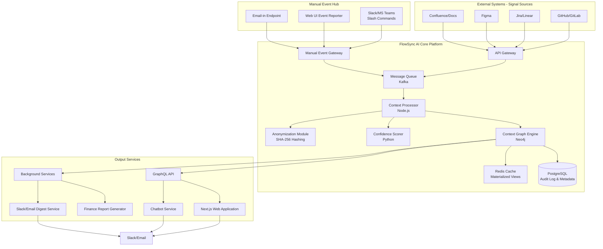

# **Technical Proposal: FlowSync AI v1.3**
**Date:** October 29, 2024
**Status:** Final
**Objective:** To define the technical architecture and implementation plan for FlowSync AI using Next.js as the frontend framework, maintaining all functionality from the previous proposal while leveraging Next.js capabilities.

---

## **1. Overview**

FlowSync AI is a context-aware engineering intelligence platform that processes signals from development tools, design systems, and manual human input to build a real-time, connected graph of work across the entire product organization. This version maintains all previous functionality while implementing Next.js for improved SEO, performance, and developer experience.

## **2. High-Level System Architecture**

The architecture remains event-driven and graph-centric, with Next.js replacing SvelteKit for the frontend:



## **3. Detailed Tech Stack & Justification**

| **Component** | **Technology** | **Justification** |
| :--- | :--- | :--- |
| **Frontend Framework** | **Next.js 14+ (App Router)** | Excellent SEO capabilities, strong React ecosystem, server-side rendering for improved performance, and incremental static regeneration for dynamic content. |
| **API & Event Processing** | Node.js (TypeScript) | Superior async handling for high volumes of webhook events and manual inputs. Strong typing for complex data structures. |
| **Context Graph** | Neo4j | Native graph database optimized for traversing complex relationships between commits, PRs, tickets, designs, and people. |
| **Metadata & Audit Log** | PostgreSQL | Strong relational data integrity for user data, audit trails, and immutable logs. |
| **Caching** | Redis | Low-latency caching for frequent graph queries and session storage. |
| **Data Processing/ML** | Python | For confidence scoring, NLP for communication analysis, and data analysis libraries (Pandas, NumPy). |
| **API Layer** | GraphQL (Apollo Server) | Efficient data fetching for complex graph data, allowing clients to request exactly what they need. |
| **Infrastructure** | Kubernetes (EKS/GKE) | Orchestration for scalable, resilient deployment of microservices. |
| **Message Queue** | Kafka | Decouples event ingestion from processing, ensuring resilience during load spikes. Perfect for event sourcing. |
| **Monitoring** | Prometheus, Grafana, ELK Stack | Metrics collection, visualization, and logging. |
| **Styling** | Tailwind CSS + shadcn/ui | Utility-first CSS with consistent component library for rapid UI development. |

## **4. Proposed Folder Structure (Next.js)**

```
flowsync-ai-monorepo/
├── 📁 apps
│   ├── 📁 api-gateway                 # GraphQL API gateway
│   │   ├── src/
│   │   │   ├── resolvers/             # GraphQL resolvers
│   │   │   ├── schema/                # GraphQL schema definitions
│   │   │   ├── middleware/            # Auth, rate limiting, etc.
│   │   │   └── index.ts
│   │   ├── package.json
│   │   └── Dockerfile
│   ├── 📁 context-worker              # Async event processing
│   │   ├── src/
│   │   │   ├── processors/            # Event processors
│   │   │   ├── lib/
│   │   │   └── index.ts
│   │   ├── package.json
│   │   └── Dockerfile
│   ├── 📁 manual-event-gateway        # HTTP gateway for manual events
│   │   ├── src/
│   │   │   ├── routes/                # HTTP route handlers
│   │   │   ├── middleware/
│   │   │   └── index.ts
│   │   ├── package.json
│   │   └── Dockerfile
│   ├── 📁 slack-bot                   # Slack integration service
│   │   ├── src/
│   │   │   ├── commands/              # Slash command handlers
│   │   │   ├── events/                # Slack event handlers
│   │   │   └── index.ts
│   │   ├── package.json
│   │   └── Dockerfile
│   └── 📁 web-app                     # Next.js frontend
│       ├── src/
│       │   ├── app/                   # App router directory
│       │   │   ├── (dashboard)/       # Route groups
│       │   │   │   ├── page.tsx
│       │   │   │   └── layout.tsx
│       │   │   ├── projects/
│       │   │   │   ├── [id]/
│       │   │   │   │   └── page.tsx
│       │   │   │   └── page.tsx
│       │   │   ├── api/               # Next.js API routes
│       │   │   │   ├── auth/
│       │   │   │   └── events/
│       │   │   ├── globals.css
│       │   │   ├── layout.tsx         # Root layout
│       │   │   └── page.tsx           # Home page
│       │   ├── components/            # Reusable components
│       │   │   ├── ui/                # shadcn/ui components
│       │   │   ├── dashboard/         # Dashboard-specific components
│       │   │   └── events/            # Event card components
│       │   ├── lib/                   # Utilities and configurations
│       │   │   ├── utils/             # Helper functions
│       │   │   ├── hooks/             # Custom React hooks
│       │   │   └── graphql/           # GraphQL client and queries
│       │   └── types/                 # TypeScript type definitions
│       ├── public/                    # Static assets
│       ├── next.config.js             # Next.js configuration
│       ├── package.json
│       └── Dockerfile
├── 📁 packages                       # Shared internal libraries
│   ├── 📁 common                     # Shared utilities and types
│   │   ├── src/
│   │   │   ├── types/                 # Shared TypeScript types
│   │   │   ├── constants/             # App-wide constants
│   │   │   └── utils/                 # Shared utilities
│   │   └── package.json
│   ├── 📁 database                   # Database clients and models
│   │   ├── src/
│   │   │   ├── neo4j/                 # Neo4j connection and queries
│   │   │   ├── postgres/              # PostgreSQL client and models
│   │   │   └── redis/                 # Redis client
│   │   └── package.json
│   ├── 📁 event-schemas              # Event schemas (Zod)
│   │   ├── src/
│   │   │   └── index.ts               # Zod schemas for all events
│   │   └── package.json
│   ├── 📁 graphql-client             # Generated GraphQL client
│   │   ├── src/
│   │   │   └── index.ts
│   │   └── package.json
│   └── 📁 ui                         # Shared UI components (Next.js)
│       ├── src/
│       │   ├── components/            # Reusable React components
│       │   └── styles/                # Shared styles
│       ├── package.json
│       └── tailwind.config.js
├── 📁 libs
│   └── 📁 confidence-engine          # Python confidence scoring
│       ├── src/
│       │   └── flowsync/
│       │       └── confidence/
│       │           ├── scorer.py      # Confidence scoring logic
│       │           └── models.py      # Data models
│       ├── tests/
│       ├── pyproject.toml
│       └── Dockerfile
├── 📁 infrastructure
│   ├── 📁 kubernetes                # K8s manifests
│   │   ├── base/                    # Common base resources
│   │   ├── overlays/                # Environment-specific configs
│   │   │   ├── development/
│   │   │   └── production/
│   │   └── kustomization.yml
│   ├── 📁 terraform                 # Terraform configs
│   │   ├── modules/                 # Reusable modules
│   │   ├── environments/            # Environment-specific configs
│   │   │   ├── dev/
│   │   │   └── prod/
│   │   └── main.tf                  # Root module
│   └── 📁 monitoring                # Monitoring configs
│       ├── prometheus/              # Prometheus configs
│       └── grafana/                 # Grafana dashboards
├── 📁 docs
│   ├── ADRs/                        # Architecture Decision Records
│   ├── api-specification/           # OpenAPI specs, GraphQL schema
│   ├── onboarding.md                # Developer onboarding guide
│   └── deployment.md                # Deployment procedures
├── 📁 scripts
│   ├── deploy/                      # Deployment scripts
│   ├── dev/                         # Development scripts
│   └── migration/                   # Database migration scripts
├── docker-compose.yml               # Local development environment
├── package.json                     # Root package.json (for workspaces)
├── turbo.json                       # Turborepo configuration
├── .github/                         # GitHub workflows
│   └── workflows/
│       ├── ci.yml
│       └── cd.yml
├── .gitignore
├── next.config.js                   # Root Next.js config (if needed)
└── README.md
```

## **5. Key Technical Components & Features**

### **5.1. Next.js Application Structure**
*   **App Router:** Utilizes Next.js 14+ App Router for improved performance, SEO, and developer experience
*   **API Routes:** Internal API endpoints for client-side data fetching
*   **Server Components:** Used for data fetching and static generation where appropriate
*   **Client Components:** For interactive UI elements and real-time updates

### **5.2. Manual Event Hub**
*   **Function:** Provides first-class API for human-reported events through multiple channels
*   **Components:**
    *   Slack/MS Teams slash command handler (`/flowsync start [ticket]`, `/flowsync deploy [ticket]`)
    *   Web UI for event reporting built with Next.js App Router
    *   Email-in endpoint for legacy workflows

### **5.3. Context Processing Engine**
*   **Function:** Ingests and correlates events from both automated and manual sources
*   **Handling Signal Ambiguity:** Uses weighted algorithm to cross-reference signals

### **5.4. Enhanced Next.js Features**
*   **Static Generation:** For documentation and landing pages
*   **Server-Side Rendering:** For authenticated dashboard content
*   **Incremental Static Regeneration:** For frequently updated activity feeds
*   **Middleware:** For authentication and route protection
*   **API Routes:** For server-side operations and integrations

## **6. Implementation Considerations with Next.js**

1. **Authentication Strategy:**
   - Use NextAuth.js for streamlined authentication with GitHub OAuth
   - Middleware for route protection and API authentication

2. **Data Fetching Strategy:**
   - Server Components for initial data loading (SEO-friendly)
   - Client-side data fetching with SWR or TanStack Query for real-time updates
   - GraphQL Apollo Client for efficient data management

3. **Styling Approach:**
   - Tailwind CSS for utility-first styling
   - shadcn/ui for consistent, accessible component library
   - CSS Modules for component-scoped styles

4. **State Management:**
   - React Context for global state (auth, theme)
   - Zustand for complex client state management
   - URL search params for filter and view states

5. **Performance Optimization:**
   - Next.js Image optimization for assets
   - Dynamic imports for code splitting
   - Redis caching for frequent data queries

## **7. Migration Impact Assessment**

**Benefits of Next.js:**
- Stronger React ecosystem and talent pool
- Excellent SEO capabilities for public documentation
- Improved performance with App Router and React Server Components
- Better TypeScript support and developer experience
- More established deployment patterns and infrastructure

**Considerations:**
- Slightly steeper learning curve for App Router vs Pages Router
- Different deployment configuration needed for server components
- Need to establish patterns for mixing server and client components

**No Impact on:**
- Backend services and architecture
- Database schemas and graph structure
- Event processing pipelines
- External integrations

## **8. Recommended Implementation Plan**

1. **Phase 1: Foundation Setup**
   - Initialize Next.js application with TypeScript
   - Configure authentication with NextAuth.js
   - Set up shared UI component library
   - Establish data fetching patterns

2. **Phase 2: Core Features**
   - Implement dashboard with activity feed
   - Build manual event reporting UI
   - Create project management pages
   - Develop real-time updates system

3. **Phase 3: Enhanced Functionality**
   - Implement advanced filtering and search
   - Add offline capability support
   - Optimize performance and loading states
   - Enhance mobile responsiveness