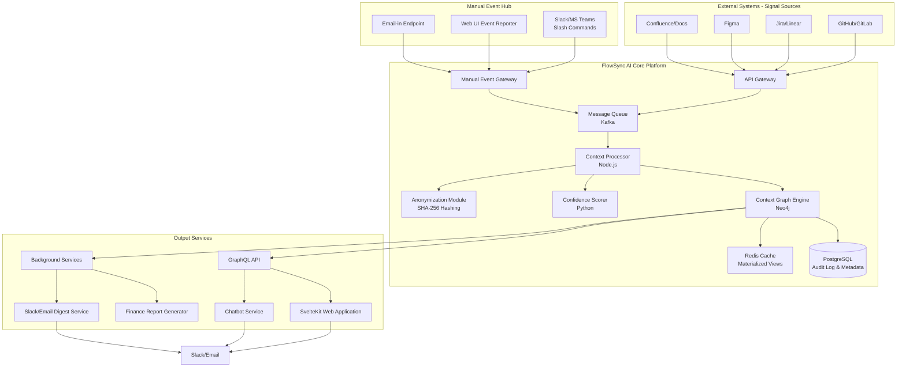

# **Technical Proposal: FlowSync AI v1.3**
**Date:** October 29, 2024
**Status:** Final
**Objective:** To define the technical architecture and implementation plan for FlowSync AI, an enterprise-wide coordination layer that integrates both automated and manual signals to provide verifiable, role-specific insights across engineering, design, and business teams.

---

## **1. Overview**

FlowSync AI is a context-aware engineering intelligence platform that processes signals from development tools, design systems, and manual human input to build a real-time, connected graph of work across the entire product organization. Its core value is eliminating manual status reporting and providing verifiable insights through a proactive chatbot and automated digests, while explicitly supporting non-CI/CD environments and extending value to non-engineering teams.

## **2. High-Level System Architecture**

The architecture is built around a **Event-Driven, Graph-Centric** design that treats manual and automated signals with equal importance.

## **3. Detailed Tech Stack & Justification**

| **Component** | **Technology** | **Justification** |
| :--- | :--- | :--- |
| **API & Event Processing** | Node.js (TypeScript) | Superior async handling for high volumes of webhook events and manual inputs. Strong typing for complex data structures. |
| **Context Graph** | Neo4j | Native graph database optimized for traversing complex relationships between commits, PRs, tickets, designs, and people. |
| **Metadata & Audit Log** | PostgreSQL | Strong relational data integrity for user data, audit trails, and immutable logs. |
| **Caching** | Redis | Low-latency caching for frequent graph queries and session storage. |
| **Data Processing/ML** | Python | For confidence scoring, NLP for communication analysis, and data analysis libraries (Pandas, NumPy). |
| **Frontend** | SvelteKit | Excellent performance characteristics ideal for a data-dashboard application. Superior developer experience. |
| **API Layer** | GraphQL (Apollo Server) | Efficient data fetching for complex graph data, allowing clients to request exactly what they need. |
| **Infrastructure** | Kubernetes (EKS/GKE) | Orchestration for scalable, resilient deployment of microservices. |
| **Message Queue** | Kafka | Decouples event ingestion from processing, ensuring resilience during load spikes. Perfect for event sourcing. |
| **Monitoring** | Prometheus, Grafana, ELK Stack | Metrics collection, visualization, and logging. |

## **4. Key Technical Components & Features**

### **4.1. Manual Event Hub**
*   **Function:** Provides first-class API for human-reported events through multiple channels.
*   **Components:**
    *   Slack/MS Teams slash command handler (`/flowsync start [ticket]`, `/flowsync deploy [ticket]`)
    *   Web UI for event reporting
    *   Email-in endpoint for legacy workflows
*   **Provenance Tracking:** All manual events receive a `source: manual_user_report` tag and are stored with full audit trail.

### **4.2. Context Processing Engine**
*   **Function:** Ingests and correlates events from both automated and manual sources.
*   **Handling Signal Ambiguity:** Uses weighted algorithm to cross-reference signals:
    *   Branch name patterns (`feature/PROJ-123`)
    *   Code diffs (files changed)
    *   Linked tickets
    *   Manual event reports
    *   Design file tags
*   **Output:** Emits enriched "Context Events" with confidence scores and provenance metadata.

### **4.3. Extended Ecosystem Integrations**
*   **Figma Integration:** API listener for `#flowsync` tags in design files; automatically links designs to tickets/PRs.
*   **Confluence/Docs Integration:** Scans for `#flowsync` tags in documentation; connects content to features.
*   **Finance Reporting Engine:** Generates capitalization reports from verifiable engineering activity data.

### **4.4. Confidence Scoring Service (Python)**
*   **Function:** Calculates confidence ranges for all assertions based on signal quality and source reliability.
*   **Rules Engine:** Manual events have different confidence weighting than automated signals.
*   **Output:** Confidence bands (e.g., 60-80%) for all AI-generated insights.

### **4.5. The Context Graph (Neo4j) Schema**
*   **Nodes:** `User`, `Commit`, `PullRequest`, `JiraTicket`, `DesignFile`, `ContentDoc`, `DeploymentEvent`.
*   **Relationships:** `AUTHORED_BY`, `LINKED_TO`, `DESIGNED_FOR`, `DOCUMENTS`, `DEPLOYS`.
*   **Role-Based Views:** Materialized subgraphs pre-computed for different personas (Engineer, Designer, Product Manager).

### **4.6. The SvelteKit Web Application**
*   **Pages:**
    *   **Dashboard (Role-Specific):** Personalized views for Engineers, Designers, PMs.
    *   **Manual Event Reporter:** Simple UI for reporting deployments and status changes.
    *   **Project Health:** Drill-down views with confidence scores.
    *   **Admin Guardrails:** Configuration for automation rules and confidence thresholds.
    *   **Finance Portal:** Capitalization reports and engineering investment analytics.

## **5. Data Flow for Key Scenarios**

### **5.1. Manual Deployment Reporting**
1. Developer runs manual deployment script
2. Developer sends Slack command: `/flowsync deploy PROJ-456 to production`
3. Manual Event Gateway receives command, validates auth
4. Event is placed in Kafka queue
5. Context Processor enriches event with user, ticket, and code context
6. Context Graph updates ticket status to "Done" with provenance tag
7. Notification is sent to content team for documentation updates
8. Finance system records time allocation for capitalization

### **5.2. Design-Dev Handoff**
1. Designer tags Figma frame: `#flowsync PROJ-789`
2. Figma webhook sends update to API Gateway
3. Context Processor links design to ticket PROJ-789
4. When developer starts work on PROJ-789, designer gets automated notification
5. When PR is created, design is automatically linked in PR description

## **6. Implementation Phasing**

### **Phase 1: Core Platform & Manual Event Hub (v0.5 - MVP)**
*   Context Graph with GitHub/Jira integration
*   Manual Event Hub (Slack commands + Web UI)
*   Basic confidence scoring
*   Daily digest generation
*   SvelteKit dashboard for engineers and PMs

### **Phase 2: Extended Ecosystem & Refinement (v1.0 - GA)**
*   Figma integration for design teams
*   Confluence/Docs integration for content teams
*   Enhanced trust framework with admin guardrails
*   Finance reporting foundation
*   GDPR-compliant data model

### **Phase 3: Advanced Intelligence (v1.5+)**
*   Predictive analytics for project timelines
*   Advanced chatbot with causal reasoning
*   Team health and skill gap analysis
*   Custom plugin framework for enterprise integrations

## **7. Dependencies**

1.  **Internal:**
    *   Authentication Service v2 (OAuth management for multiple platforms).
    *   Billing API (for tier-based feature access).
2.  **External:**
    *   GitHub/GitLab, Jira/Linear, Figma, Slack/MS Teams API reliability.
    *   SOC 2 Compliance Framework for enterprise tier.
3.  **Team:**
    *   Data Science expertise for refining the confidence scoring algorithm.
    *   Frontend expertise for SvelteKit and responsive design.
    *   Platform team for Kubernetes infrastructure.

## **8. Risks & Mitigations**

| **Risk** | **Mitigation Strategy** |
| :--- | :--- |
| **Manual Event Verification** | Implement reputation scoring for users; require secondary confirmation for critical actions; maintain full audit trail. |
| **Extended Ecosystem API Limits** | Implement aggressive caching and webhook-based updates instead of polling where possible. |
| **Data Schema Complexity** | Invest in initial schema design; use migration scripts for incremental changes; implement strict versioning. |
| **Cross-Team Adoption** | Provide immediate value to each team individually; create role-specific onboarding flows; showcase wins from early adopters. |
| **Performance at Scale** | Implement query cost estimation in Neo4j; use materialized views; employ Redis caching strategically. |

## **9. Success Metrics**

| **Metric** | **Target** | **Measurement Method** |
| :--- | :--- | :--- |
| **Manual Event Processing Time** | < 100ms | End-to-end latency monitoring |
| **Context Graph Query Performance** | < 1s at 1M nodes | Load testing and performance profiling |
| **Event Processing Accuracy** | > 99.9% | Comparison with ground truth data |
| **Cross-Team Adoption Rate** | > 30% of company | Active users by department |
| **User Satisfaction Score** | > 4.5/5.0 | Quarterly user surveys |

---
**Approval:**

Technical Lead: _________________________
Date: ___________________________________